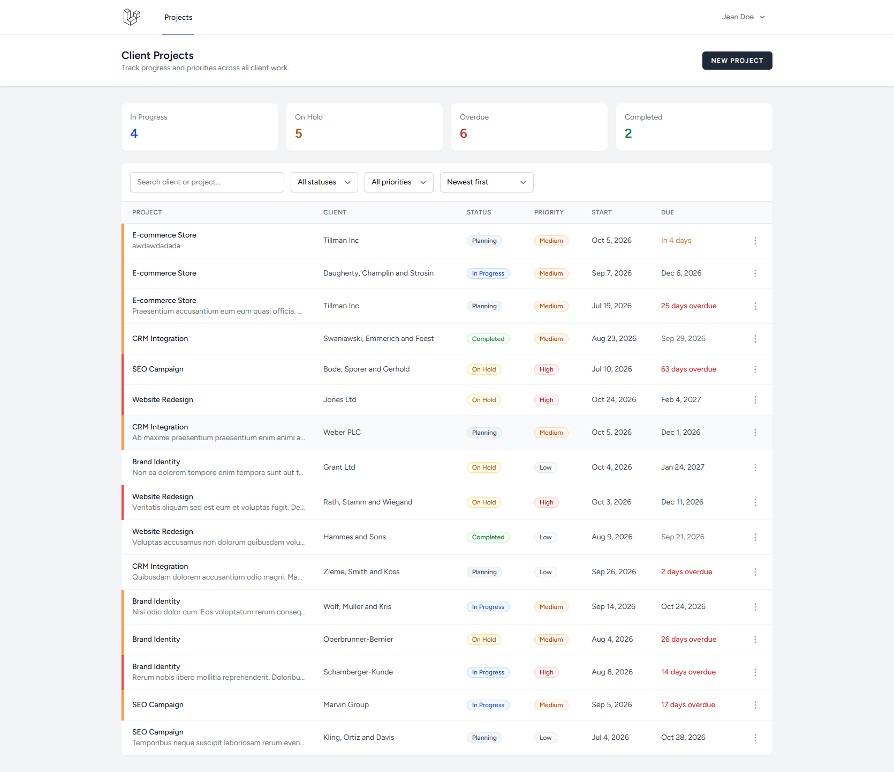

# Client Project Tracker

A web app for a digital agency's project managers to track client projects, monitor progress, and manage priorities.

It has a REST API built with Laravel and a React frontend that uses it. You can create, edit, delete, search, filter and sort projects, and see at a glance what is in progress, on hold, overdue or completed.



## Features

**Core requirements**

- REST API with full CRUD for projects
- Project list showing client, status, priority and dates
- Create and edit projects in a modal form, with validation errors shown under each field
- Delete with a confirmation step
- Validation for every required rule, with meaningful JSON error responses

**Bonus features**

- **Search** by client or project name
- **Filtering** by status and priority, plus an "overdue" filter
- **Sorting** by due date, priority (Low < Medium < High) or newest
- **Authentication**: register, log in, log out, password reset and a profile page. The projects page and the API both require login.
- **Tests** written with Pest

**Extra details**

- Summary cards (In Progress / On Hold / Overdue / Completed). Clicking a card filters the list.
- Due dates shown as "3 days overdue", "Due today" or "In 5 days", in red or amber where they need attention
- A coloured stripe on each row for priority
- Responsive: a table on desktop and stacked cards on mobile
- Loading, empty, "no results" and error states

## Tech stack

| Layer    | Technology                                       |
| -------- | ------------------------------------------------ |
| Backend  | Laravel 12 (PHP 8.2+)                            |
| Frontend | React 18, Inertia.js, Tailwind CSS, Headless UI  |
| Database | MySQL                                            |
| Auth     | Laravel Breeze + Sanctum (session-based SPA auth) |
| Tests    | Pest                                             |

## Getting started

### Requirements

- PHP 8.2 or newer, and Composer
- Node.js 18 or newer, and npm
- MySQL 8 (or MariaDB)

### Setup

```bash
# 1. Clone and install dependencies
git clone <repository-url> project-tracker
cd project-tracker
composer install
npm install

# 2. Configure the environment
cp .env.example .env
php artisan key:generate
```

Create an empty MySQL database called `project_tracker`. If your MySQL username or password is not `root` with no password, change `DB_USERNAME` and `DB_PASSWORD` in `.env`.

```bash
# 3. Create the tables and load sample data (a test user and 15 projects)
php artisan migrate --seed

# 4. Build the frontend and start the server
npm run build
php artisan serve
```

Open **http://127.0.0.1:8000** and log in with the seeded test account:

| Email              | Password   |
| ------------------ | ---------- |
| `test@example.com` | `password` |

You can also register a new account from the login page.

### Development

To have frontend changes show up without rebuilding, run Vite's dev server alongside Laravel:

```bash
php artisan serve
npm run dev
```

### Running tests

```bash
php artisan test
```

Tests use an in-memory SQLite database, so they don't touch your MySQL data.

> **Using a different port or host?** The frontend calls the API using the browser's login session. That only works for hosts listed in `SANCTUM_STATEFUL_DOMAINS` in `.env`, which by default covers `localhost` and `127.0.0.1` on ports 8000 and 8080. If you serve the app anywhere else, add that host and port to the list, then run `php artisan config:clear`.

## API reference

All endpoints are under `/api` and need an authenticated session; otherwise they return `401`. Send `Accept: application/json`.

The easiest way to try the GET endpoints is to log in to the app, then open them in the same browser, e.g. http://127.0.0.1:8000/api/projects?status=On%20Hold.

| Method   | Endpoint             | Description          | Success |
| -------- | -------------------- | -------------------- | ------- |
| `GET`    | `/api/projects`      | List projects        | `200`   |
| `GET`    | `/api/projects/{id}` | Get one project      | `200`   |
| `POST`   | `/api/projects`      | Create a project     | `201`   |
| `PUT`    | `/api/projects/{id}` | Update a project     | `200`   |
| `DELETE` | `/api/projects/{id}` | Delete a project     | `204`   |

> The brief lists `/projects`. The endpoints use Laravel's standard `/api` prefix so they stay separate from the web pages. `/projects` is the page that shows the UI.

### Project fields

| Field          | Type   | Rules                                                        |
| -------------- | ------ | ------------------------------------------------------------ |
| `client_name`  | string | **Required**, max 255                                        |
| `project_name` | string | **Required**, max 255                                        |
| `description`  | string | Optional                                                     |
| `status`       | string | **Required**, one of `Planning`, `In Progress`, `On Hold`, `Completed` |
| `priority`     | string | **Required**, one of `Low`, `Medium`, `High`                 |
| `start_date`   | date   | Optional, `YYYY-MM-DD`                                       |
| `due_date`     | date   | Optional, `YYYY-MM-DD`, **cannot be earlier than `start_date`** |

### List query parameters

`GET /api/projects` accepts these optional parameters, and you can combine them:

| Parameter  | Example                  | Description                                            |
| ---------- | ------------------------ | ------------------------------------------------------ |
| `search`   | `?search=acme`           | Matches client name or project name                    |
| `status`   | `?status=In Progress`    | Only projects with this status                         |
| `priority` | `?priority=High`         | Only projects with this priority                       |
| `overdue`  | `?overdue=1`             | Past due date and not completed                        |
| `sort`     | `?sort=-priority`        | `due_date`, `start_date`, `priority`, `created_at`. Prefix with `-` for descending. Default: `-created_at` |

Invalid values, such as `?status=Done` or `?sort=password`, return `422`.

### Example: create a project

```http
POST /api/projects
Content-Type: application/json
Accept: application/json

{
  "client_name": "Acme Corp",
  "project_name": "Website Redesign",
  "description": "Full redesign of the marketing site",
  "status": "In Progress",
  "priority": "High",
  "start_date": "2026-10-01",
  "due_date": "2026-12-15"
}
```

`201 Created`

```json
{
  "data": {
    "id": 16,
    "client_name": "Acme Corp",
    "project_name": "Website Redesign",
    "description": "Full redesign of the marketing site",
    "status": "In Progress",
    "priority": "High",
    "start_date": "2026-10-01",
    "due_date": "2026-12-15",
    "created_at": "2026-10-05T08:30:00.000000Z",
    "updated_at": "2026-10-05T08:30:00.000000Z"
  }
}
```

The list endpoint also returns `meta.counts` (`in_progress`, `on_hold`, `overdue`, `completed`). These are always counted across **all** projects, not the filtered list, so the summary cards stay stable while you filter.

### Errors

**Validation failed** → `422 Unprocessable Content`

```json
{
  "message": "The client name field is required. (and 1 more error)",
  "errors": {
    "client_name": ["The client name field is required."],
    "due_date": ["Due date cannot be earlier than start date."]
  }
}
```

**Project not found** → `404 Not Found`

```json
{ "message": "Resource not found." }
```

**Not logged in** → `401 Unauthorized`

```json
{ "message": "Unauthenticated." }
```

## Project structure

```
app/
├── Enums/ProjectStatus.php, ProjectPriority.php   # Allowed values, one source of truth
├── Http/
│   ├── Controllers/ProjectController.php          # CRUD + list filters
│   ├── Requests/StoreProjectRequest.php           # Validation rules and messages
│   └── Resources/ProjectResource.php              # JSON shape of a project
└── Models/Project.php                             # Casts + query scopes (search, overdue, sortBy)

resources/js/
├── api/projects.js                                # Axios client for the REST API
├── Pages/Projects/Index.jsx                       # Page: state, filters, data loading
└── Components/Projects/
    ├── SummaryCards.jsx                           # Status counts / quick filters
    ├── ProjectToolbar.jsx                         # Search, filters, sort
    ├── ProjectTable.jsx, ProjectCards.jsx         # Desktop table / mobile cards
    ├── ProjectFormModal.jsx                       # Create + edit form
    ├── DeleteProjectModal.jsx                     # Delete confirmation
    └── Badges.jsx, ProjectActions.jsx, dates.js   # Small shared pieces
```

## Technical decisions

**Status and priority are PHP enums, not lookup tables.**
They are fixed values from the brief, and the app's logic depends on them: badge colours, the priority sort order, the overdue rule. Storing them as strings backed by enums keeps them in one place. Validation (`Rule::enum`), model casting and the frontend dropdowns all read from the same enum. Lookup tables would make sense if admins needed to add or rename statuses.

**The frontend talks to the REST API, not Inertia props.**
Inertia is used for routing, the layout and auth pages. Project data is always loaded and saved through `/api/projects` with Axios, so the UI really uses the API the brief asks for, and any other client could do the same.

**Filtering, search and sorting run on the server.**
The API supports them as query parameters, so they would still work with thousands of projects or with a different client. Query parameters are validated and `sort` is checked against a fixed list, so user input never reaches `ORDER BY` directly.

**Session-based API auth with Sanctum.**
The React frontend runs on the same domain, so it uses the normal Laravel login session (cookie and CSRF protection) instead of API tokens. That means no tokens stored in the browser. If the session expires, the frontend reloads and Laravel sends the user to the login page.

**Projects are shared by all logged-in users.**
In an agency, project managers usually work on the same set of client projects, so projects are not owned by individual users. Per-user ownership or roles would be a straightforward next step (see below).

**Duplicate project names are allowed.**
The brief doesn't require unique names, and a client can reasonably have two projects with the same name, e.g. a yearly campaign.

**Small, focused components.**
The page component manages state and data loading. Each UI piece (toolbar, table, cards, modals) receives data and callbacks as props. Date logic like "3 days overdue" lives in one helper that both the table and the mobile cards use.

## What I'd do with more time

- More API feature tests covering every validation rule, filter and sort option
- Pagination for the project list
- Roles and permissions (e.g. only managers can delete), or assigning projects to users
- A Kanban board view grouped by status
- Docker setup (Laravel Sail) and a deployed demo
